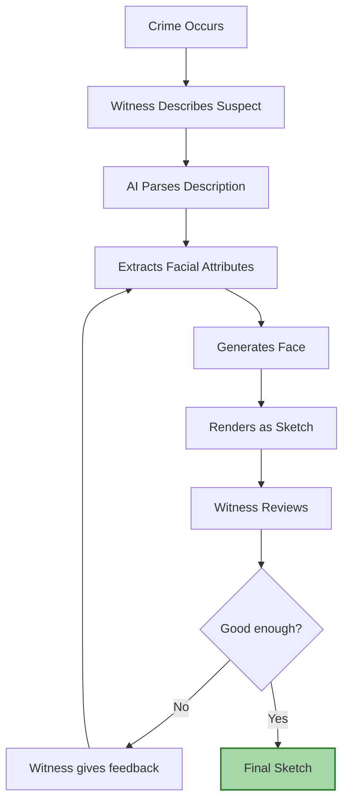
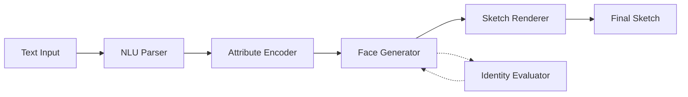
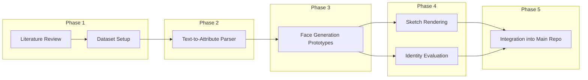

<p align="center">
  <strong>Forensic Sketch Generator</strong><br/>
  <em>Research Lab & Team Notebook</em>
</p>

<p align="center">
  <a href="https://github.com/Sradha2474/Forensic-Sketch-Generator">🔗 Main Production Repo</a> · 
  <a href="./docs/research-roadmap.md">Roadmap</a> · 
  <a href="./papers/">Papers</a> · 
  <a href="./tasks/ownership.md">Team Roles</a>
</p>

---

## What is this?

This is our team's research notebook — not production code.

We use this repo to read papers, sketch out architectures, run experiments, log findings, and stay aligned as a team. Think of it as our shared lab journal.

The actual production codebase lives here → **[Forensic-Sketch-Generator](https://github.com/Sradha2474/Forensic-Sketch-Generator)**

---

## The Problem

Forensic sketch creation still depends on a trained artist sitting with a witness for hours, drawing and redrawing based on verbal descriptions. It's slow, subjective, hard to scale, and bottlenecked by artist availability.

We're building an AI system that takes a witness's natural language description and generates a forensic-quality sketch — with iterative refinement until the witness approves.

> The keyword is **assist**, not replace. This tool supports investigators, it doesn't make legal decisions.

---

## How It Works



---

## Research Modules

Our pipeline breaks down into five modules. Each one is a separate research problem.



| # | Module | What it does | We're exploring |
|---|--------|-------------|-----------------|
| 1 | **NLU Parser** | Turns witness text into structured JSON attributes | DistilBERT, self-attention, zero-shot LLMs |
| 2 | **Attribute Encoder** | Maps JSON features to latent vectors | MLP mappers, projection layers |
| 3 | **Face Generator** | Synthesizes a photorealistic face from latents | StyleGAN2-ADA, Diffusion Models |
| 4 | **Sketch Renderer** | Converts the photo into a pencil-style forensic sketch | OpenCV, Neural Style Transfer, Pix2Pix |
| 5 | **Identity Evaluator** | Checks if the sketch preserves identity vs ground truth | ArcFace, FaceNet, cosine similarity |

<details>
<summary><strong>Example: NLU Parser input → output</strong></summary>

**Input:**
> "Male, around 35, oval face, brown eyes, scar on left cheek"

**Output:**
```json
{
  "gender": "male",
  "age": 35,
  "face_shape": "oval",
  "eye_color": "brown",
  "scar": "left_cheek"
}
```
</details>

---

## Repo Structure

Click any folder to browse it directly.

| Folder | What's inside |
|--------|--------------|
| [**`docs/`**](./docs/) | Problem statement, literature review, roadmap, evaluation metrics, glossary |
| [**`papers/`**](./papers/) | Paper summaries + downloaded PDFs (ArcFace, StyleGAN2, FaceNet, Attention, Pix2Pix) |
| [**`architecture/`**](./architecture/) | Mermaid diagrams — system overview, training flow, inference pipeline |
| [**`datasets/`**](./datasets/) | Dataset docs for CelebA, FFHQ, CUHK, and preprocessing pipelines |
| [**`paper-implementations/`**](./paper-implementations/) | Our from-scratch implementations of core paper algorithms |
| [**`experiments/`**](./experiments/) | Experiment logs, configs, and results (organized per experiment) |
| [**`prototypes/`**](./prototypes/) | Sandbox code — notebooks, quick tests, early-stage modules |
| [**`tasks/`**](./tasks/) | Sprint plans, backlog, and task ownership matrix |
| [**`resources/`**](./resources/) | Books, YouTube links, GitHub repos, and references we find useful |

---

## Roadmap



---

## Team

<table>
  <tr>
    <td align="center">
      <a href="https://github.com/Sradha2474">
        <br/>
        <strong>Sradha</strong>
      </a>
    </td>
    <td align="center">
      <a href="https://github.com/Tusharkanta407">
        <br/>
        <strong>Tushar</strong>
      </a>
    </td>
    <td align="center">
      <a href="https://github.com/sandeepswain54">
        <br/>
        <strong>Sandeep</strong>
      </a>
    </td>
  </tr>
</table>

Detailed role assignments → [**tasks/ownership.md**](./tasks/ownership.md)

---

## How We Work

- **Experiments** go in [`experiments/`](./experiments/) — one folder per experiment, each with an objective, results, and next steps.
- **Paper reviews** follow a consistent template — see [`papers/README.md`](./papers/README.md) for the format.
- **No random files** in root. Prototypes live in [`prototypes/`](./prototypes/), scratch code stays in experiments.
- **Sprint tracking** happens in [`tasks/`](./tasks/) — we update before each weekly sync.

---

## License

MIT — see the LICENSE file in our [main repo](https://github.com/Sradha2474/Forensic-Sketch-Generator).