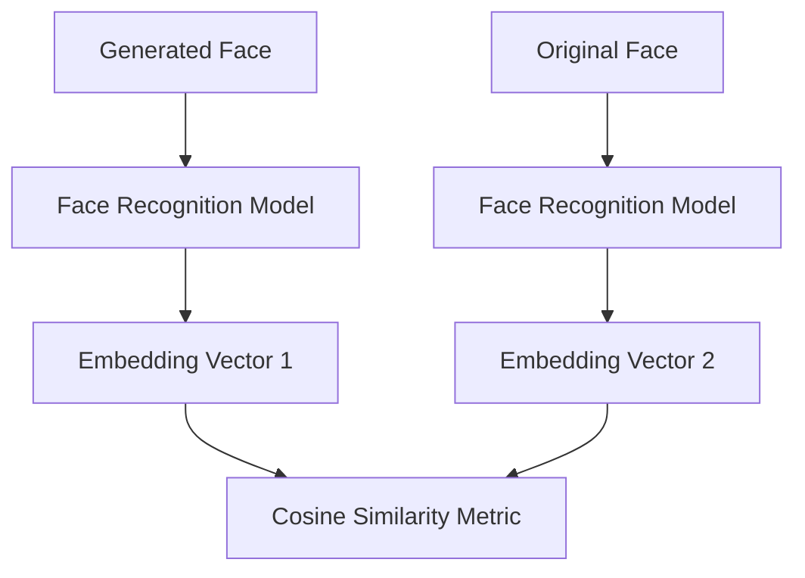
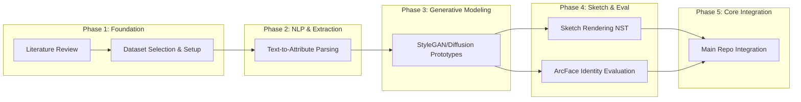

# 🔍 Forensic Sketch Generator — Research Lab

Welcome to the **Forensic Sketch Generator Research Lab** repository. This is our team's central research notebook, experimental laboratory, and academic review library.

> [!IMPORTANT]
> **Repository Purpose:** This repository is strictly for research, experiments, documentation, datasets, architecture diagrams, paper summaries, prototypes, and team journals.
> Production-ready codebase, web interface, and final implementations live in our main repository: 🔗 **[Forensic-Sketch-Generator (Main Repo)](https://github.com/Sradha2474/Forensic-Sketch-Generator)**.

---

## 💡 Vision
To **assist** investigators in rapidly generating, refining, and evaluating forensic sketches from witness descriptions using artificial intelligence. 
*Note: The system is designed to support investigators and forensic artists, not to replace them or make legal decisions.*

---

## ❓ Problem Statement
Every year, thousands of criminal investigations begin with nothing more than a witness's memory. Traditional forensic sketch creation depends heavily on a trained forensic artist who interviews the witness and gradually creates a suspect sketch. This process has several challenges:
* 🕒 **Time-consuming:** Revisions and back-and-forth take days.
* 🎓 **High Skill Required:** Requires highly trained forensic artists.
* 🗣️ **Communication Barriers:** Quality depends heavily on witness recollection/articulation.
* 🎨 **Subjective Quality:** Results vary widely between artists.
* 📉 **Scalability:** Hard to scale when multiple investigations require sketches concurrently.

As a result, valuable investigation time can be lost during the early stages of an investigation.

---

## 🎯 Project Goals
The goal is to build an AI-assisted system that converts witness descriptions into realistic forensic sketches while allowing iterative refinement and objective evaluation:
1. **Understand** natural language witness descriptions.
2. **Extract** structured facial attributes.
3. **Generate** an initial suspect face.
4. **Allow** iterative refinement based on witness feedback.
5. **Evaluate** how closely the generated sketch resembles the ground-truth face during research experiments (for model evaluation, not suspect identification).
6. **Provide** investigators with an accelerating tool.

---

## 🔄 Workflow Comparison

```mermaid
graph TD
    %% Existing Workflow
    subgraph Existing Workflow
        A1[Crime Occurs] --> B1[Witness Recalls]
        B1 --> C1[Police Interview]
        C1 --> D1[Forensic Artist Interview]
        D1 --> E1[Manual Sketch Creation]
        E1 --> F1[Revision Cycles]
        F1 --> G1[Final Hand-drawn Sketch]
    end

    %% Proposed Workflow
    subgraph Proposed AI-Assisted Workflow
        A2[Crime Occurs] --> B2[Witness Description]
        B2 --> C2[AI NLP System]
        C2 --> D2[Facial Attribute Extraction]
        D2 --> E2[Face Generator]
        E2 --> F2[Generated Sketch]
        F2 --> G2[Witness Feedback]
        G2 --> H2{Refinement Needed?}
        H2 -- Yes --> I2[Adjust Attributes]
        I2 --> E2
        H2 -- No --> J2[Final Approved Sketch]
    end

    style G1 fill:#ff9999,stroke:#333,stroke-width:2px
    style J2 fill:#99ff99,stroke:#333,stroke-width:2px
```



---

## 🧩 Core Research Modules

The project is broken down into five core research modules:

### [Module 1: Natural Language Understanding](./prototypes/parser/)
Translates unstructured textual witness descriptions into a structured attribute format.
* **Input:** *"Male, around 35, oval face, brown eyes, scar on left cheek"*
* **Output (JSON):**
  ```json
  {
    "gender": "male",
    "age": 35,
    "face_shape": "oval",
    "eye_color": "brown",
    "scar": "left_cheek"
  }
  ```

### [Module 2: Attribute Encoding](./prototypes/parser/)
Converts the structured description JSON into numerical vectors/latents that the generation model can consume.

### [Module 3: Face Generation](./prototypes/generator/)
Generates a highly plausible photo-realistic face based on the extracted attribute embeddings.
* *Possible models under research:* Conditional GANs, StyleGAN2/3, Latent Diffusion Models (LDM).

### [Module 4: Sketch Rendering](./prototypes/sketch/)
Converts the generated photorealistic face into a forensic-style sketch.
* *Possible methods:* OpenCV edge/pencil shaders, Neural Style Transfer (NST), Pix2Pix.

### [Module 5: Evaluation](./prototypes/arcface/)
Quantifies how well the generated sketch preserves identity compared to the ground-truth photo.


---

## 🗺️ Research Roadmap



---

## 📁 Repository Structure

* 📄 **[README.md](./README.md)** — Lab overview, team roles, core modules, and roadmap.
* 📂 **[docs/](./docs/)** — Detailed research documentation.
  * [problem-statement.md](./docs/problem-statement.md) | [literature-review.md](./docs/literature-review.md) | [research-roadmap.md](./docs/research-roadmap.md) | [datasets.md](./docs/datasets.md) | [evaluation.md](./docs/evaluation.md) | [meeting-notes.md](./docs/meeting-notes.md) | [glossary.md](./docs/glossary.md)
* 📂 **[papers/](./papers/)** — Structured reviews of core papers.
  * [README.md](./papers/README.md) | [attention-is-all-you-need.md](./papers/attention-is-all-you-need.md) | [arcface.md](./papers/arcface.md) | [facenet.md](./papers/facenet.md) | [stylegan2.md](./papers/stylegan2.md)
* 📂 **[architecture/](./architecture/)** — Mermaid diagram source files.
  * [system-architecture.mmd](./architecture/system-architecture.mmd) | [pipeline.mmd](./architecture/pipeline.mmd) | [training-flow.mmd](./architecture/training-flow.mmd) | [inference-flow.mmd](./architecture/inference-flow.mmd)
* 📂 **[datasets/](./datasets/)** — Dataset documentation and preprocessing scripts.
  * [celeba.md](./datasets/celeba.md) | [ffhq.md](./datasets/ffhq.md) | [forensic-datasets.md](./datasets/forensic-datasets.md) | [preprocessing.md](./datasets/preprocessing.md)
* 📂 **[experiments/](./experiments/)** — Sandbox directories for experimental configurations and logs.
  * [experiment-001-arcface/](./experiments/experiment-001-arcface/) | [experiment-002-generator/](./experiments/experiment-002-generator/) | [experiment-003-sketch/](./experiments/experiment-003-sketch/) | [logs.md](./experiments/logs.md)
* 📂 **[prototypes/](./prototypes/)** — Early phase scripts, notebooks, and models.
  * [attention/](./prototypes/attention/) | [arcface/](./prototypes/arcface/) | [generator/](./prototypes/generator/) | [parser/](./prototypes/parser/) | [sketch/](./prototypes/sketch/)
* 📂 **[tasks/](./tasks/)** — Task management and sprints.
  * [backlog.md](./tasks/backlog.md) | [sprint-01.md](./tasks/sprint-01.md) | [sprint-02.md](./tasks/sprint-02.md) | [ownership.md](./tasks/ownership.md)
* 📂 **[resources/](./resources/)** — Learning links, references, and references.
  * [books.md](./resources/books.md) | [github-links.md](./resources/github-links.md) | [youtube.md](./resources/youtube.md) | [references.md](./resources/references.md)

---

## 👥 Meet the Research Team

We are a collaborative group of researchers and engineers. Below are our roles, focus areas, and primary contributions. Detailed task lists can be found in [tasks/ownership.md](./tasks/ownership.md).

| Profile Picture | Member Name | Role | Primary Responsibilities | Contact |
| :---: | :--- | :--- | :--- | :---: |
|  | **Shraddha** | **Project Lead & Architect** | Overall architecture design, direction, team coordination, code review integration. | [@Sradha2474](https://github.com/Sradha2474) |
|  | **Tushar** | **Research Lead** | Paper analysis, mathematical review, prototype drafting, core documentation. | [@Tusharkanta407](https://github.com/Tusharkanta407) |
|  | **Sandeep** | **ML Engineer** | Experiment execution, training loops, model testing, dataset preprocessing support. | [@sandeepswain54](https://github.com/sandeepswain54) |

---

## 🤝 Collaboration Guidelines

1. **Keep Code clean:** Avoid dumping raw, unorganized python files in root directories. Use [experiments/](./experiments/) for training logs and [prototypes/](./prototypes/) for sandbox models.
2. **Document Everything:** Every new paper reviewed should follow the template defined in [papers/README.md](./papers/README.md).
3. **Verify via Logs:** When completing an experiment, add a brief log entry in [experiments/logs.md](./experiments/logs.md) and reference the specific experiment folder.\n