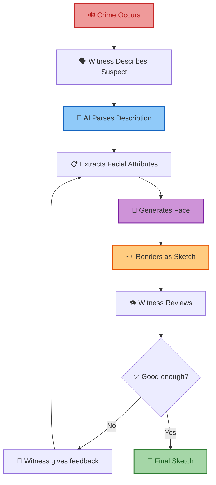
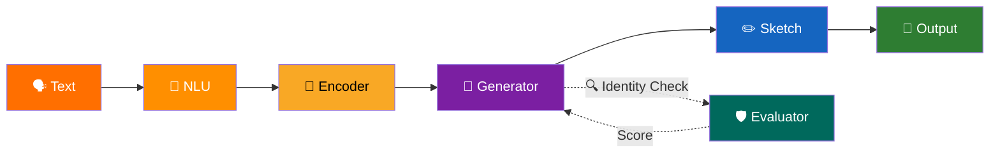
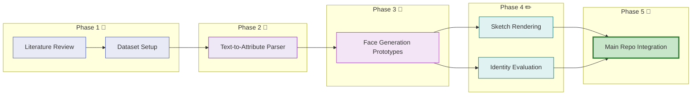

<h1 align="center">
  🧬 Forensic Sketch Generator
</h1>

<p align="center">
  <strong>Research Lab&nbsp;&nbsp;·&nbsp;&nbsp;Team Notebook&nbsp;&nbsp;·&nbsp;&nbsp;Experiment Journal</strong>
</p>

<p align="center">
  <a href="https://github.com/Sradha2474/Forensic-Sketch-Generator"></a>&nbsp;
  <a href="./docs/research-roadmap.md"></a>&nbsp;
  <a href="./papers/"></a>&nbsp;
  <a href="./tasks/ownership.md"></a>
</p>

<p align="center">
  
  
  
  
</p>

---

### What is this?

This is our team's research notebook — not production code.

We read papers here, sketch architectures, run experiments, log findings, and stay aligned. Think of it as our shared lab journal.

Production codebase lives here → **[Forensic-Sketch-Generator](https://github.com/Sradha2474/Forensic-Sketch-Generator)**

---

### The Problem

Forensic sketch creation still depends on a trained artist sitting with a witness for hours. It's slow, subjective, hard to scale, and bottlenecked by artist availability.

We're building an AI system that takes a witness's natural language description and generates a forensic-quality sketch — with iterative refinement until the witness approves.

> **Assist**, not replace. This tool supports investigators, it doesn't make legal decisions.

---

### How It Works



---

### Research Modules

Our pipeline is five separate research problems:

<table>
  <tr>
    <td align="center"></td>
    <td>Turns witness text → structured JSON attributes</td>
    <td><code>DistilBERT</code> · <code>Self-Attention</code> · <code>Zero-shot LLMs</code></td>
  </tr>
  <tr>
    <td align="center"></td>
    <td>Maps JSON features → latent vectors</td>
    <td><code>MLP Mappers</code> · <code>Projection Layers</code></td>
  </tr>
  <tr>
    <td align="center"></td>
    <td>Synthesizes photorealistic face from latents</td>
    <td><code>StyleGAN2-ADA</code> · <code>Diffusion Models</code></td>
  </tr>
  <tr>
    <td align="center"></td>
    <td>Converts photo → pencil-style forensic sketch</td>
    <td><code>OpenCV</code> · <code>NST</code> · <code>Pix2Pix</code></td>
  </tr>
  <tr>
    <td align="center"></td>
    <td>Checks identity preservation vs ground truth</td>
    <td><code>ArcFace</code> · <code>FaceNet</code> · <code>Cosine Similarity</code></td>
  </tr>
</table>



<details>
<summary><strong>↳ Example: NLU Parser input → output</strong></summary>
<br/>

**Input:**
> "Male, around 35, oval face, brown eyes, scar on left cheek"

**Output:**
```json
{
  "gender": "male",
  "age": 35,
  "face_shape": "oval",
  "eye_color": "brown",
  "scar": "left_cheek"
}
```
</details>

---

### Repo Structure

Click any folder to browse it.

<table>
  <tr>
    <td><a href="./docs/"></a></td>
    <td>Problem statement, literature review, roadmap, evaluation metrics, glossary</td>
  </tr>
  <tr>
    <td><a href="./papers/"></a></td>
    <td>Paper summaries + PDFs organized by publisher</td>
  </tr>
  <tr>
    <td>&nbsp;&nbsp;&nbsp;&nbsp;<a href="./papers/concept/"></a></td>
    <td>Foundational papers — Attention, ArcFace, FaceNet, StyleGAN, StyleGAN2, Pix2Pix</td>
  </tr>
  <tr>
    <td>&nbsp;&nbsp;&nbsp;&nbsp;<a href="./papers/IEEE/"></a></td>
    <td>Text-to-Face, Sketch-to-Photo, Face Sketch Recognition, Photo Synthesis</td>
  </tr>
  <tr>
    <td>&nbsp;&nbsp;&nbsp;&nbsp;<a href="./papers/ELSEVIER/"></a></td>
    <td>DCGAN and generative adversarial network research</td>
  </tr>
  <tr>
    <td>&nbsp;&nbsp;&nbsp;&nbsp;<a href="./papers/Research-GATE/"></a></td>
    <td>Forensic sketch generation using Gen-AI and DCGAN review papers</td>
  </tr>
  <tr>
    <td><a href="./architecture/"></a></td>
    <td>Mermaid diagrams — system overview, training flow, inference pipeline</td>
  </tr>
  <tr>
    <td><a href="./datasets/"></a></td>
    <td>CelebA, FFHQ, CUHK dataset docs and preprocessing pipelines</td>
  </tr>
  <tr>
    <td><a href="./paper-implementations/"></a></td>
    <td>From-scratch implementations of core paper algorithms</td>
  </tr>
  <tr>
    <td><a href="./experiments/"></a></td>
    <td>Experiment logs, configs, results — organized per experiment</td>
  </tr>
  <tr>
    <td><a href="./prototypes/"></a></td>
    <td>Sandbox code — notebooks, quick tests, early-stage modules</td>
  </tr>
  <tr>
    <td><a href="./tasks/"></a></td>
    <td>Sprint plans, backlog, task ownership</td>
  </tr>
  <tr>
    <td><a href="./resources/"></a></td>
    <td>Books, YouTube, GitHub repos, references</td>
  </tr>
</table>

---

### Roadmap



---

### Team & Guide

#### 🎓 Project Guide & Advisor
<table>
  <tr>
    <td align="center">
      <a href="https://www.linkedin.com/in/dr-sukant-k-bisoy-21701176/">
        <br/>
        <sub><strong>Dr. Sukant K. Bisoyi</strong></sub><br/>
        <sub>Dean & Professor, CSE Dept.</sub><br/>
        <sub>C. V. Raman Global University</sub>
      </a>
    </td>
  </tr>
</table>

#### 👥 Research Team
<table>
  <tr>
    <td align="center">
      <a href="https://github.com/Sradha2474">
        <br/>
        <sub><strong>Sradha</strong></sub>
      </a>
    </td>
    <td align="center">
      <a href="https://github.com/Tusharkanta407">
        <br/>
        <sub><strong>Tushar</strong></sub>
      </a>
    </td>
    <td align="center">
      <a href="https://github.com/sandeepswain54">
        <br/>
        <sub><strong>Sandeep</strong></sub>
      </a>
    </td>
  </tr>
</table>

Role assignments → [**tasks/ownership.md**](./tasks/ownership.md)

---

### How We Work

- **Experiments** go in [`experiments/`](./experiments/) — one folder per experiment with objective, results, next steps.
- **Paper reviews** follow the template in [`papers/README.md`](./papers/README.md).
- **No random files** in root. Prototypes → [`prototypes/`](./prototypes/). Scratch code → experiments.
- **Sprint tracking** in [`tasks/`](./tasks/) — updated before each weekly sync.

---

<p align="center">
  
  &nbsp;
  <a href="https://github.com/Sradha2474/Forensic-Sketch-Generator"></a>
</p>