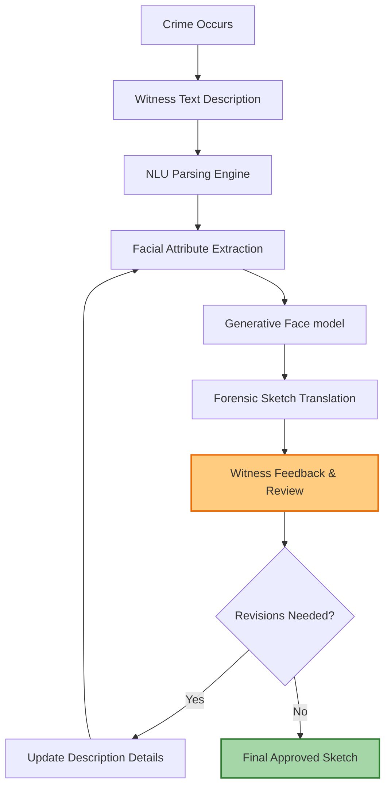
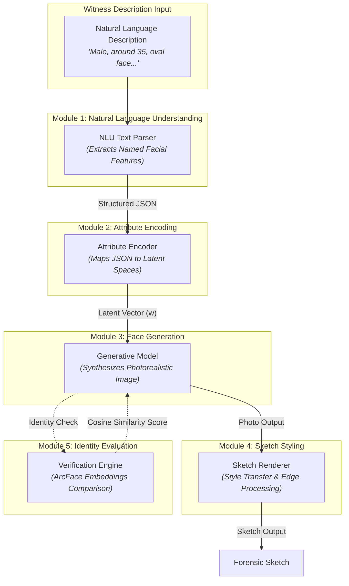

# Forensic Sketch Generator — Research Lab

Welcome to our research lab and notebook. This repository serves as our team's collaborative workspace for model exploration, paper reviews, dataset preparation, and experimental logging.

> [!NOTE]
> **Workspace Scope:** We use this repository exclusively for research, literature analysis, architectural planning, and algorithmic prototyping. Our production codebase, frontend interface, and deployment assets are maintained in our main repository: **[Forensic-Sketch-Generator (Main Repo)](https://github.com/Sradha2474/Forensic-Sketch-Generator)**.

---

## Vision
Our goal is to build an AI-assisted system that converts natural language witness descriptions into realistic forensic sketches, allowing for iterative refinement and identity-preserving evaluation. We focus on assisting forensic investigators and artists rather than replacing them.

---

## Problem Statement
Every year, thousands of criminal investigations begin with only a witness's memory. Traditional forensic sketch creation relies on a trained artist interviewing the witness and iteratively drawing the suspect. This manual process faces several challenges:
* **Time-consuming:** Revisions can take days.
* **Skill Scarcity:** Trained forensic artists are not always readily available.
* **Subjective Interpretation:** Results vary depending on the artist's style and communication efficiency.
* **Scalability Limitations:** Local departments often cannot scale sketch creation during high-demand periods.

We aim to bridge this gap by providing an interactive, AI-driven generation tool that speeds up the initial sketching phase.

---

## Proposed AI-Assisted Workflow



---

## Core Research Modules
We partition our research and model development into five modular components:



### Module 1 Parse Example
* **Input Description:** *"Male, around 35, oval face, brown eyes, scar on left cheek"*
* **Parsed Output (JSON):**
  ```json
  {
    "gender": "male",
    "age": 35,
    "face_shape": "oval",
    "eye_color": "brown",
    "scar": "left_cheek"
  }
  ```

---

## Research Directory Map
We organize our workspace directory structure by research scope and file type to maintain a clean environment:

| Directory | Scope & Purpose |
| :--- | :--- |
| **`docs/`** | Comprehensive problem analysis, roadmaps, literature review papers, and dataset briefs. |
| **`papers/`** | Repository of academic PDFs (StyleGAN2, ArcFace, Attention, etc.) and structured summary files. |
| **`architecture/`** | Sequence diagrams, training schedules, and inference pipelines represented in Mermaid formats. |
| **`datasets/`** | Preprocessing scripts, data annotation schemas, and configuration for CelebA and FFHQ. |
| **`paper-implementations/`** | Standalone boilerplate scripts for building and testing core paper layers from scratch. |
| **`experiments/`** | Tracking logs, configuration variables, training performance checkpoints, and metrics. |
| **`prototypes/`** | Jupyter Notebook playgrounds, sandbox models, and scratch preprocessing scripts. |
| **`tasks/`** | Sprint plans, backlog charts, and task allocation metrics. |
| **`resources/`** | Reading lists, video tutorials, external Git repositories, and web link bookmarks. |

---

## Active Research Team
We coordinate our tasks, review milestones, and discuss architecture decisions collectively.

| Profile Picture | Researcher | Role | Core Responsibility | GitHub Profile |
| :---: | :--- | :--- | :--- | :---: |
|  | **Sradha** | *TBD* | *TBD* | [@Sradha2474](https://github.com/Sradha2474) |
|  | **Tushar** | *TBD* | *TBD* | [@Tusharkanta407](https://github.com/Tusharkanta407) |
|  | **Sandeep** | *TBD* | *TBD* | [@sandeepswain54](https://github.com/sandeepswain54) |

---

## Collaboration Guidelines
1. **Commit Hygiene:** We keep our model experiments inside `experiments/` and clean prototypes in `prototypes/`. We do not dump raw files in the root directory.
2. **Reviewing Papers:** When we review a new paper, we update the `papers/README.md` index and write a summary following our markdown template.
3. **Tracking Sprints:** We update task statuses inside `tasks/` before weekly alignment syncs.

---

## License
We license this research notebook under the **MIT License**. For details, see the LICENSE file in our main repository.