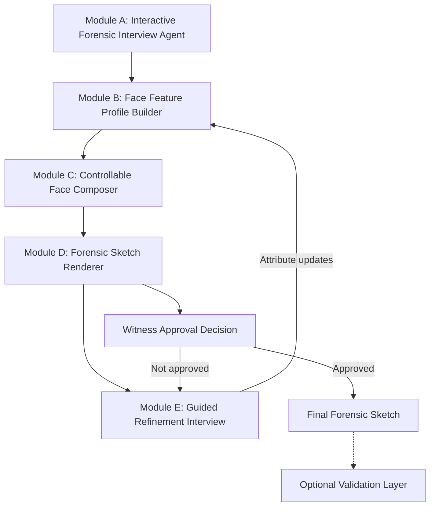

# (5) Proposed Solution with Block Diagram

**Status:** Approved (included in Interim DOCX)  

---

## 5.1 Overview of the Proposed Framework

This work proposes an AI-assisted forensic sketch generation framework that digitizes the operational workflow of composite construction. In conventional practice, a trained forensic artist conducts a Cognitive Interview, elicits feature-level descriptions, constructs a likeness, and revises the composite under continuous witness guidance. The proposed system replicates this procedure computationally: an interactive interview agent elicits facial information in a structured sequence, maintains a feature profile, synthesizes a controllable facial representation, renders a forensic-style sketch, and supports iterative refinement until witness approval.

In contrast to end-to-end prompt-to-image approaches, including the base Gen-AI forensic pipeline that maps textual prompts directly to diffusion-generated sketches and mugshot retrieval, the present design prioritizes interview alignment, attribute-level controllability, explicit sketch rendering, and witness-in-the-loop revision. The framework is intended as an assistive investigative tool; it does not replace the witness as the source of recalled information, nor does it constitute a legal determination of identity.

---

## 5.2 System Architecture

The architecture comprises five operational modules and an optional research validation layer, as illustrated in Figure 1.

**Figure 1.** Block diagram of the proposed AI-assisted forensic sketch generation framework.

### Correspondence to Forensic Practice

| Conventional forensic procedure | Proposed system component |
|---------------------------------|---------------------------|
| Cognitive Interview and feature prompting | Module A — Interactive Forensic Interview Agent |
| Catalog-based feature selection and note-taking | Module B — Face Feature Profile Builder |
| Construction of facial likeness | Module C — Controllable Face Composer |
| Pencil rendering / composite styling | Module D — Forensic Sketch Renderer |
| Continuous revision with the witness | Module E — Guided Refinement Interview |
| Research-time identity / quality assessment | Optional Validation Layer |

---

## 5.3 Interactive Interview Protocol

Module A implements an interview state machine inspired by Cognitive Interview (CI) and Holistic Cognitive Interview (H-CI) procedures used in composite construction. The agent progresses through the following phases:

1. **Context reinstatement:** The witness is prompted to mentally reinstate the viewing conditions of the incident.  
2. **Free recall:** An uninterrupted description of the face is elicited and recorded.  
3. **Global descriptors:** Coarse attributes are collected (approximate age, sex, build where available).  
4. **External features:** Hair characteristics and overall face shape are queried.  
5. **Internal features:** Eyes, eyebrows, nose, mouth, and ears are queried in turn.  
6. **Distinctive marks:** Scars, moles, tattoos, facial hair, eyewear, and related identifiers are elicited with spatial localization.  
7. **Holistic verification (optional):** Global impressions of the emerging likeness are assessed.  
8. **Visual catalog assistance:** Where verbalization is insufficient, reference exemplars are presented for selection.

The interview does not fabricate unstated attributes. Incomplete responses are retained as unknown and excluded from forced inference. The accumulated responses constitute the input to Module B.

---

## 5.4 Module Specifications

### Module A — Interactive Forensic Interview Agent

This module manages dialogue state, question sequencing, and adaptive follow-up (for example, requesting scar laterality after a mark is mentioned). It is realized using a large language model constrained by a forensic interview protocol and a deterministic phase controller.

**Input:** Witness responses within an active session.  
**Output:** Ordered interview turns and extracted descriptors for profile update.

### Module B — Face Feature Profile Builder

This module maintains a structured facial attribute profile (demographics, face geometry, hair, periocular features, nose, mouth, ears, distinctive marks, and accessories). The profile is updated incrementally across interview turns and serves as the sole conditioning interface to the generative stages.

**Input:** Parsed descriptors from Module A (and later from Module E).  
**Output:** Structured feature profile for generation and editing.

### Module C — Controllable Face Composer

This module projects the feature profile into a generative latent representation and synthesizes a photorealistic facial image. Controllability is required so that refinement may edit selected attributes without regenerating an unrelated identity.

**Input:** Feature profile.  
**Output:** High-resolution facial image.  
**Model direction:** Attribute-conditioned StyleGAN2-ADA (or an equivalent controllable generator).

### Module D — Forensic Sketch Renderer

This module transforms the synthesized face into a monochrome, pencil-style forensic composite suitable for investigative use.

**Input:** Photorealistic facial image.  
**Output:** Forensic sketch.  
**Methods:** Classical edge-based rendering and/or image-to-image translation (Pix2Pix / CycleGAN) trained on photo–sketch corpora such as CUFS/CUFSF.

### Module E — Guided Refinement Interview

Following presentation of the sketch, the agent conducts a targeted revision dialogue analogous to mid-session artist adjustments (for example, ocular spacing, jaw width, or scar position). Only affected profile fields are updated; Modules C–D are then re-executed.

**Input:** Current sketch and witness revision responses.  
**Output:** Updated feature profile fields and revised composite.

### Optional Validation Layer

For experimental evaluation, biometric and quality metrics may be computed (for example, ArcFace or FaceNet cosine similarity, FID, attribute consistency). This layer supports research reporting and is not required for operational sketch sessions.

---

## 5.5 Operational Workflow

1. An investigative session is initiated with the witness.  
2. Module A executes the interview protocol; Module B constructs the feature profile.  
3. Module C synthesizes a facial image; Module D renders the forensic sketch.  
4. Module E conducts refinement until witness approval is obtained.  
5. The approved sketch is exported as the session output.  
6. Where ground-truth references exist, the validation layer may quantify identity preservation and generation quality.

---

## 5.6 Datasets

| Dataset | Purpose |
|---------|---------|
| CelebA | Attribute vocabulary and conditional supervision |
| FFHQ | High-fidelity face generation prior |
| CUFS / CUFSF | Photo–sketch translation and sketch-domain evaluation |

---

## 5.7 Technology Stack

| Layer | Technology |
|-------|------------|
| Client application | Next.js (App Router), TypeScript, React |
| Application programming interface | Next.js Route Handlers and/or a Python inference service (FastAPI) |
| Machine learning runtime | Python 3.10+, PyTorch 2.0+ |
| Interview and language processing | Transformer / LLM dialogue models with protocol constraints |
| Computer vision | OpenCV, PIL; StyleGAN2-ADA; sketch translation networks |
| Experimental validation | ArcFace / FaceNet embedding comparison |
| Deployment | Docker; GPU-enabled inference worker as required |

---

## 5.8 Anticipated Outcome

The proposed framework is expected to yield an investigator-facing Next.js application capable of conducting a structured forensic interview, constructing and refining forensic-style composites under witness guidance, and reducing composite turnaround from multi-hour manual sessions to minutes, while preserving alignment with established composite interviewing practice.
