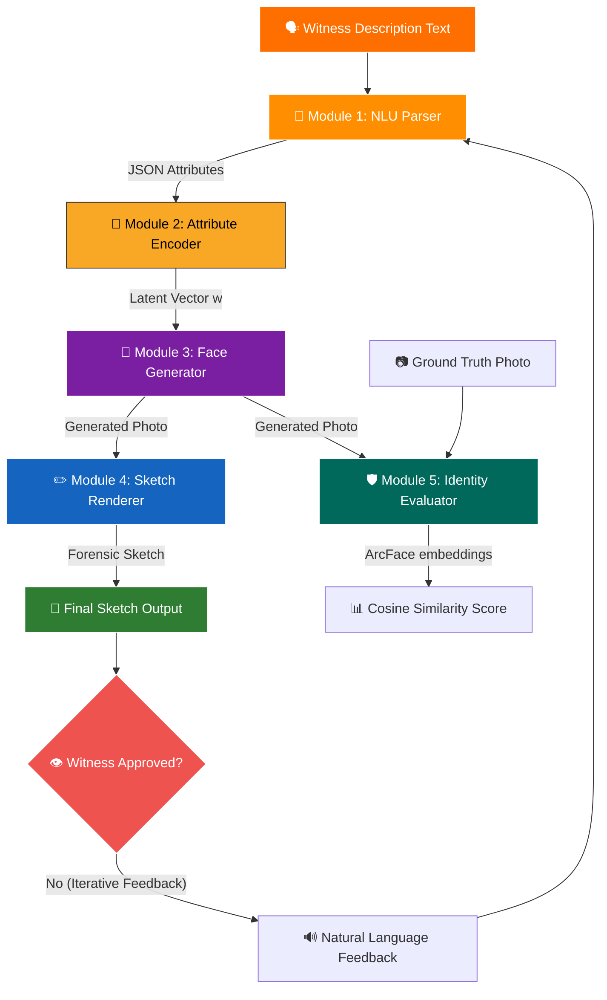

# Research Proposal: AI-Assisted Forensic Sketch Generator

## 1. Problem Specification

In criminal investigations, identifying suspects when surveillance footage is unavailable relies on witness recall. Traditionally, forensic artists conduct lengthy, subjective interviews to sketch suspects. However, this process faces severe challenges: a critical scarcity of trained forensic artists, high cognitive load on witnesses during hours of interrogation, and drawing biases that lead to inaccurate depictions. Delays in producing sketches slow down the crucial initial hours of an investigation. We propose an AI-assisted pipeline that translates witness natural language descriptions into structured facial features, generates high-fidelity faces, renders them as sketches, and enables interactive witness refinement to output forensic-quality suspect sketches in minutes.

---

## 2. Introduction

Forensic sketch generation is the process of translating a victim's or witness's verbal description of a suspect into a visual portrait. Historically, this has been a cornerstone of criminal identification when biometric data or surveillance imagery is absent. A sketch serves as a vital public alert and database query tool. 

The traditional workflow relies on a cognitive interview, where a forensic artist prompts a witness's memory and iteratively draws facial components. This manual process is heavily bottlenecked. First, the shortage of certified forensic artists means local police departments face long queues. Second, the process is highly subjective, relying on the artist's interpretation of descriptive adjectives (e.g., "medium nose") and their drawing style. This subjectivity introduces cognitive bias, which can lead to false leads. Lastly, the physical drawing takes hours, during which a witness's memory of the traumatic event decays or becomes distorted by the artist's intermediate drafts.

Integrating generative artificial intelligence (Gen-AI) addresses these limitations by transforming sketch generation into an automated, interactive, and standardized tool. Rather than replacing the human investigator, AI acts as an assistant. By inputting natural language directly, the system can parse descriptors, map them to latent spaces, and synthesize a high-fidelity rendering instantly. This immediate feedback loop allows witnesses to review and modify specific facial attributes incrementally, aligning with how human memory recalls faces—not in isolation, but through comparative adjustment.

This project aims to build a modular, AI-driven forensic sketch generator. The system will leverage a Transformer-based NLP engine to extract facial attributes, a StyleGAN2 face synthesis model, and an image-to-image translation network to render the face as a pencil sketch. An evaluation module utilizing ArcFace will verify identity preservation against ground truth images. The expected outcome is a web-based, interactive tool capable of generating highly accurate, forensic-quality sketches in minutes, thereby accelerating suspect identification, reducing administrative bottlenecks, and establishing a scalable framework for digital law enforcement.

---

## 3. Literature Survey

### Paper 1: Text-to-Face Generation (FTGAN)
* **Objective:** Synthesize fine-grained, realistic face images directly from natural language descriptions.
* **Method:** Replaces the traditional frozen, pre-trained text encoders (like Char-CNN-RNN) with a joint training strategy. The Fully Trained Generative Adversarial Network (FTGAN) updates both the text encoder and the image generator simultaneously to capture word-level facial attributes.
* **Advantages:** Captures granular facial details (e.g., eye color, scars) and achieves higher similarity between descriptions and synthesized images (59% on SCU-Text2face).
* **Limitations:** Higher training complexity and risk of training instability because both text and image networks are backpropagating gradients together.
* **Why We Use It:** It shows that joint text-image training prevents the loss of specific facial descriptors, which is essential for capturing witness details in Module 1.

### Paper 2: StyleGAN / Conditional GAN (StyleGAN2 & cCycleGAN)
* **Objective:** Generate high-resolution, photorealistic human faces with controllable attributes.
* **Method:** Replaces progressive growing with skip-connections and uses weight demodulation instead of AdaIN to remove water-droplet artifacts. A conditional version of CycleGAN (cCycleGAN) is used to map sketches to photos using unpaired data, guided by attribute vector injection.
* **Advantages:** Produces state-of-the-art $1024 \times 1024$ photorealistic images with a highly disentangled latent space ($W$-space), making attribute manipulation simple.
* **Limitations:** Extremely high computational overhead for training and a lack of direct natural language conditioning in vanilla StyleGAN2.
* **Why We Use It:** We exploit StyleGAN2's $W$-space in Module 3 to perform fine-grained adjustments on individual features (e.g., age, face shape) during the iterative witness feedback loop.

### Paper 3: ArcFace
* **Objective:** Learn highly discriminative face embeddings on a hyperspherical manifold for face recognition.
* **Method:** Introduces an Additive Angular Margin Loss ($\mathcal{L} = -\frac{1}{N} \sum \log \frac{e^{s \cos(\theta_{y_i} + m)}}{e^{s \cos(\theta_{y_i} + m)} + \sum e^{s \cos \theta_j}}$), which penalizes the geodesic distance between target weights and embeddings.
* **Advantages:** Maximizes inter-class separation and minimizes intra-class variance, leading to state-of-the-art face verification accuracy.
* **Limitations:** Highly sensitive to alignment noise and requires high-quality, normalized input images ($112 \times 112$).
* **Why We Use It:** In Module 5, it measures how well the generated forensic sketch preserves the facial identity of the suspect by comparing its embedding to a ground-truth photo.

### Paper 4: FaceNet
* **Objective:** Map face images directly to a unified, low-dimensional Euclidean space where distances correspond to similarity.
* **Method:** Utilizes a deep CNN trained on Triplet Loss ($\mathcal{L} = \max(0, \|f(x^a) - f(x^p)\|^2_2 - \|f(x^a) - f(x^n)\|^2_2 + \alpha)$), which minimizes anchor-positive distance while maximizing anchor-negative distance.
* **Advantages:** Maps faces to a compact 128-dimensional space and performs face verification, recognition, and clustering without intermediate classification layers.
* **Limitations:** Selecting semi-hard triplets for training is computationally expensive and slow to converge.
* **Why We Use It:** It serves as our baseline identity verification metric, helping us compare the mathematical behavior of Euclidean (FaceNet) vs. angular (ArcFace) embedding spaces.

### Paper 5: ControlNet & Latent Diffusion Models
* **Objective:** Enable highly controllable, high-fidelity image generation based on text and spatial constraints.
* **Method:** Locks a pre-trained Latent Diffusion Model (LDM) and duplicates its encoder paths to train conditional controls (e.g., edges, sketches, depth maps) using zero convolutions.
* **Advantages:** Exceptional image quality, high diversity, and fine-grained spatial control over layouts and sketch lines.
* **Limitations:** Slow inference speeds compared to GANs, requiring multiple denoising steps.
* **Why We Use It:** It provides a state-of-the-art baseline for converting structural sketch inputs into realistic face photos.

---

## 4. Research Gap

Despite advancements in generative models, significant gaps remain between general face synthesis and forensic sketch systems:

* **Forensic Artist Dependency:** Existing systems focus on translating already drawn sketches to photos (Sketch-to-Photo), still requiring an artist to draw the initial sketch. They do not address the starting point: translating natural language text to a face.
* **Lack of Iterative Refinement:** Current GAN or diffusion pipelines are one-shot generators. They lack interactive feedback loops that let a witness modify specific attributes (e.g., adding a scar or narrowing the jawline) without regenerating the entire face.
* **Poor Identity Preservation:** Most sketch-photo translation models focus on style aesthetics rather than verifying whether the generated image preserves the distinct biometric identity of the suspect.
* **Lack of Integration:** NLP models and image generators are typically built as isolated components. There is a lack of unified, modular systems that connect text parsing, attribute encoding, generation, sketch styling, and automated evaluation.

### Our Contribution
Our pipeline bridges these gaps by:
1. Combining **NLP parsing and Latent StyleGAN2 mapping** to bypass the initial drawing phase.
2. Implementing an **iterative witness refinement loop** via disentangled latent editing.
3. Incorporating **biometric evaluation (ArcFace)** directly into the validation pipeline.
4. Structuring a **modular architecture** where modules can be individually updated or replaced.

---

## 5. Proposed Solution

### 5.1 System Architecture

The following diagram illustrates the flow of information through our five-module pipeline:

### 5.2 Workflow

1. **Witness Interview:** The witness provides an initial natural language description of the suspect.
2. **NLU Extraction:** The NLU Parser extracts facial features and constructs a structured JSON representation.
3. **Latent Mapping:** The Attribute Encoder maps the JSON representation to StyleGAN2’s latent $w$-space.
4. **Photo Synthesis:** The Face Generator synthesizes a high-fidelity, photorealistic face from the latent vector.
5. **Sketch Rendering:** The Sketch Renderer translates the synthesized photo into a forensic pencil sketch.
6. **Witness Review & Refinement:**
   * If the witness requests modifications, they provide natural language feedback. The system updates the JSON, re-encodes, and renders the updated sketch.
   * If approved, the sketch is finalized.
7. **Identity Evaluation:** The Identity Evaluator extracts ArcFace/FaceNet embeddings from the generated sketch and the ground truth photo, computing a similarity score to validate identity preservation.

### 5.3 Module Description

#### Module 1: NLU Parser
* **Input:** Witness natural language text.
* **Output:** Structured facial attributes in JSON format.
* **Models:** DistilBERT and fine-tuned self-attention models mapping text to token categories (e.g., `{"eyes": "blue", "hair": "wavy"}`).

#### Module 2: Attribute Encoder
* **Input:** Structured JSON features.
* **Output:** Latent embedding vector $w \in \mathbb{R}^{512}$.
* **Models:** Multi-Layer Perceptron (MLP) mapping networks and linear projection layers trained to project text-attributes to StyleGAN2’s $W$ latent space.

#### Module 3: Face Generator
* **Input:** Latent vector $w$.
* **Output:** Photorealistic image ($1024 \times 1024 \times 3$).
* **Models:** StyleGAN2-ADA with custom attribute projection weights.

#### Module 4: Sketch Renderer
* **Input:** Photorealistic generated face.
* **Output:** Black-and-white, pencil-style forensic sketch.
* **Models:** OpenCV edge detection pipelines, Pix2Pix, or CycleGAN style transfer trained on CUHK sketch datasets.

#### Module 5: Identity Evaluator
* **Input:** Generated sketch and ground-truth suspect photo.
* **Output:** Cosine similarity score indicating biometric similarity.
* **Models:** Pre-trained ArcFace ResNet models and FaceNet embeddings, utilizing cosine distance calculation:
  $$\text{Similarity Score} = \cos(\theta) = \frac{\mathbf{e}_1 \cdot \mathbf{e}_2}{\|\mathbf{e}_1\| \|\mathbf{e}_2\|}$$

---

### Datasets

* **CelebA:** Contains 202,599 face images annotated with 40 binary attributes (e.g., eyeglasses, bald, wavy hair). Used to train the Attribute Encoder and Face Generator.
* **FFHQ (Flickr-Faces-HQ):** Contains 70,000 high-quality face images. Used as the baseline for pre-training StyleGAN2-ADA.
* **CUHK Face Sketch Dataset (CUFS/CUFSF):** Contains sketch-photo pairs of human faces. Used to train and evaluate the Sketch Renderer and Identity Evaluator.

---

### Training & Loss Functions

* **Adversarial Loss:** Generates sharp, realistic faces and sketches (used in GAN blocks).
* **Cycle Consistency Loss:** Used in Module 4 (CycleGAN) to align sketches and photos without paired alignment:
  $$\mathcal{L}_{cyc}(G, F) = \mathbb{E}_{x}[\|F(G(x)) - x\|_1] + \mathbb{E}_{y}[\|G(F(y)) - y\|_1]$$
* **Triplet Loss:** Used in FaceNet baseline evaluation to cluster identical faces:
  $$\mathcal{L} = \max(0, d(a, p) - d(a, n) + \alpha)$$
* **Additive Angular Margin Loss:** Maximize class separation in ArcFace:
  $$\mathcal{L} = -\frac{1}{N} \sum_{i=1}^N \log \frac{e^{s(\cos(\theta_{y_i} + m))}}{e^{s(\cos(\theta_{y_i} + m))} + \sum_{j \neq y_i} e^{s \cos \theta_j}}$$

---

### Technology Stack

* **Programming Language:** Python 3.10+
* **Deep Learning Framework:** PyTorch 2.0+
* **Image Processing:** OpenCV, PIL
* **NLP Models:** Hugging Face Transformers (DistilBERT)
* **Frontend Web Application:** Streamlit (for witness interaction and iterative editing)
* **Deployment & Containerization:** Docker

---

## 6. Results and Discussion

### Expected Advantages
* **Speed:** Generates sketches in seconds compared to hours for manual sketching.
* **Objectivity:** Bypasses artist-style bias, producing standardized facial structures.
* **Interactivity:** Disentangled latent spaces allow witnesses to easily refine features without restarting.

### Possible Limitations
* **Biased Training Data:** Models trained on CelebA/FFHQ may struggle to synthesize rare facial anomalies, scars, or diverse ethnicities.
* **Memory Decay / Witness Trauma:** The system depends on the witness's recall, which can be unstable or distorted.

### Future Improvements
* Integrating multi-modal inputs (e.g., voice descriptions combined with text).
* Implementing diffusion-based ControlNet architectures for more precise local sketch edits.

### Evaluation Metrics
1. **FID & IS:** Quality and sharpness of generated faces.
2. **SSIM:** Structural similarity between generated sketches and photos.
3. **CLIP Score:** Text-to-image semantic alignment.
4. **ArcFace Cosine Similarity:** Identity preservation validation.
